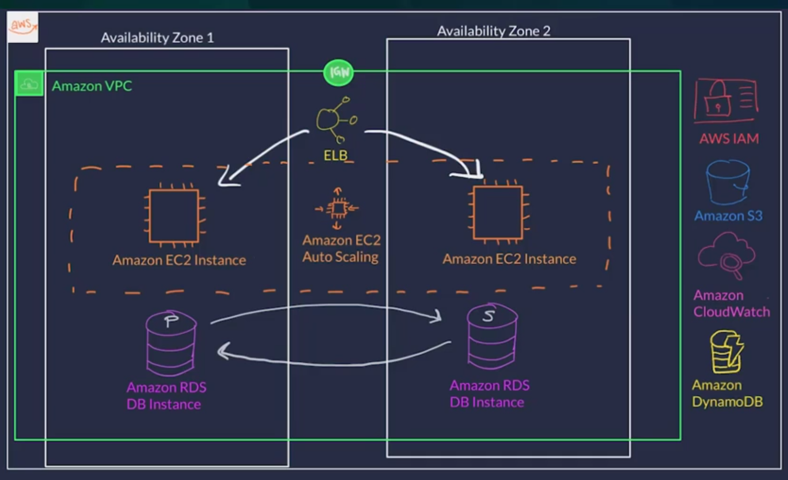

# AWS Example Application
## Description:
The purpose of this repo is to is to have an example aws application that uses a series of AWS features in order to practice proper cloud deployment practices.

## Business Scope
The application is a employee directory that lists an employee roster and provides basic information about each employee. Additionally, a photo representing the employee can be uploaded and displayed in for the user. 

## Technical Scope

The application should be a simple frontend-backend-db distributed system that uses an s3 bucket as a simple web host for the frontend code and assets, an auto-scaling group of ec2s for the backend, and DynamoDB instances for persistance. The application should have availability across at least 2 AZs, with traffic being distributed by an Elastic Load balancer. The backend must have the least amount of permissions as possible, and the entire system must be monitored through AWS CloudWatch.

Tech:
- Next.js
- React.js
- TypeScript
- Docker

For ease of deployment, the system should be configured via CloudFormation.